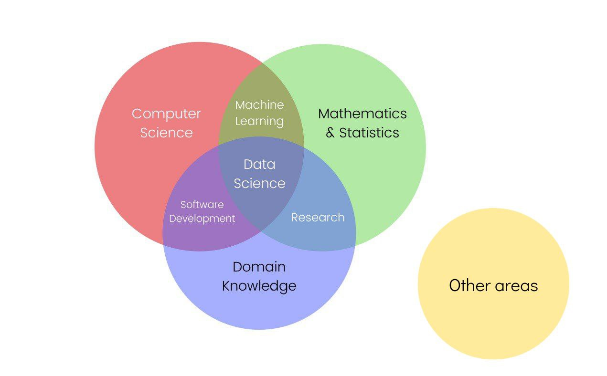

# Course-Completion-Showcase-Data-Science-Focus

This is a repository to showcase my achievement in the courses I took/am taking for self-development on the Coursera, Udemy, EPAM Learning and other platforms. I have attempted to group the courses based on the data science Venn diagram shown below. Each course includes a description of the materials covered, completed assignments, and obtained certificates. I regularly update this repository with new courses and achievements. I hope this report helps you gain an understanding of my knowledge and skills in the field of data science.

  

### (A) Computer Science

#### [Python](https://github.com/dimapuzz1e/Course-Completion-Showcase-Data-Science-Focus/tree/main/Python)

- [Crash Course on Python](https://www.coursera.org/learn/python-crash-course) (Google) ([CERT](https://www.coursera.org/account/accomplishments/certificate/A9WEEJU3SEAR))

#### [Linux](https://github.com/dimapuzz1e/Course-Completion-Showcase-Data-Science-Focus/tree/main/Linux)

- [Linux for Developers](https://www.coursera.org/learn/linux-for-developers) (The Linux Foundation) ([CERT](https://www.coursera.org/account/accomplishments/certificate/UESMSTTDQ656))
- [Linux Tools for Developers](https://www.coursera.org/learn/linux-tools-for-developers) (The Linux Foundation) ([CERT](https://www.coursera.org/account/accomplishments/certificate/FCMUDQNTSDDC))
- [Linux and Bash for Data Engineering](https://www.coursera.org/learn/linux-and-bash-for-data-engineering-duke) (Duke University) ([CERT](https://www.coursera.org/account/accomplishments/certificate/YCVXP8KCKXHZ))
- [Build a Modern Computer from First Principles: From Nand to Tetris (Project-Centered Course)](https://www.coursera.org/learn/build-a-computer) (Hebrew University of Jerusalem) ([CERT](https://www.coursera.org/account/accomplishments/certificate/Y9FGUZK9GWUV))
- [Bash Scripting and System Configuration](https://www.coursera.org/learn/codio-bash-scripting-and-system-configuration) (Codio) ([CERT](https://www.coursera.org/account/accomplishments/certificate/RY3YTJ296VMK))

### (B) Mathematics & Statistics

#### [Physics](https://github.com/dimapuzz1e/Course-Completion-Showcase-Data-Science-Focus/tree/main/Physics)

- [Mechanics: Motion, Forces, Energy and Gravity, from Particles to Planets](https://www.coursera.org/learn/mechanics-particles-planets) (UNSW Sydney (The University of New South Wales)) ([CERT](https://www.coursera.org/account/accomplishments/certificate/3YALTU5L7AB5))

### (C) Domain Expertise

### (A ∩ B) Machine Learning

#### [Algorithms](https://github.com/dimapuzz1e/Course-Completion-Showcase-Data-Science-Focus/tree/main/Algorithms)

- [Algorithmic Toolbox](https://www.coursera.org/learn/algorithmic-toolbox) (University of California San Diego) ([CERT](https://www.coursera.org/account/accomplishments/certificate/CXZSW9EJUBD5))
- [Data Structures](https://www.coursera.org/learn/data-structures) (University of California San Diego) ([CERT](https://www.coursera.org/account/accomplishments/certificate/3PA48ZUSKEEC))

### (B ∩ C) Research

### (A ∩ C) Software Development

### (A ∩ B ∩ C) Data Science

### (D) Other areas

#### [English](https://github.com/dimapuzz1e/Course-Completion-Showcase-Data-Science-Focus/tree/main/English)

- [English for Career Development](https://www.coursera.org/learn/careerdevelopment) (University of Pennsylvania) ([CERT](https://www.coursera.org/account/accomplishments/certificate/KK8285M5C2R8))
- [English for Career Development](https://kpi.ua/regulations-v) (National Technical University of Ukraine “Igor Sikorsky Kyiv Polytechnic Institute) (Data Base Closed)

#### [German](https://github.com/dimapuzz1e/Course-Completion-Showcase-Data-Science-Focus/tree/main/German)

- [DSD Sprachdiplom- C1 Niveau](https://en.wikipedia.org/wiki/Deutsches_Sprachdiplom_Stufe_I_and_II) (der Kultusministerkonferenz) (Data Base Closed)
- [DSD Sprachdiplom- B1 Niveau](https://en.wikipedia.org/wiki/Deutsches_Sprachdiplom_Stufe_I_and_II) (der Kultusministerkonferenz) (Data Base Closed)
- [Bestätigung für DSD](https://en.wikipedia.org/wiki/Deutsches_Sprachdiplom_Stufe_I_and_II) (der Kultusministerkonferenz) (Data Base Closed)
- [DSD2 - Sprachcamps](https://www.auslandsschulwesen.de/SharedDocs/Kurzmeldungen/Webs/ZfA/DE/Aktuelles/2021/210616_DSD-Sprachcamp_Ukraine.html) (die ZFA) (Data Base Closed)
- [Urkunde Deutsche Schule Kiew](https://deutscheschule.kiev.ua/) (Deutsche Schule Kiew) (Data Base Closed)
